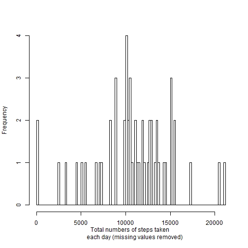
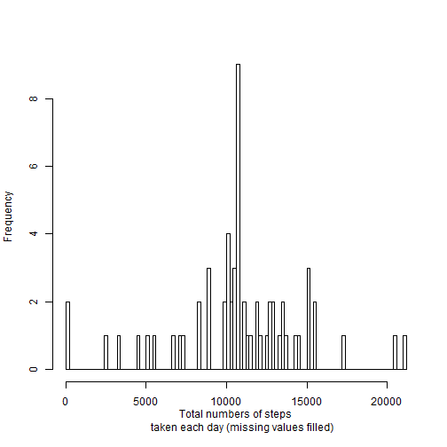
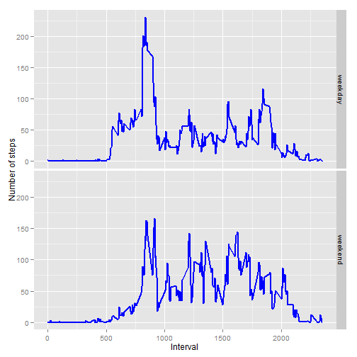

# Reproducible Research: Peer Assessment 1

## Loading required packages


```r
library(reshape2)
library(xtable)
library(ggplot2)
```


## Loading and preprocessing the data

- Set working directory
- Unzip the data file
- Read in unzipped data file


```r
setwd("~/../RepData_Peerassessment1")
unzip("activity.zip")
DF <- read.csv("activity.csv", na.strings = "NA", 
               colClasses = c("numeric", "Date", "numeric"))
```


## What is mean total number of steps taken per day?


### Make a histogram of the total number of steps taken each day

- Remove NAs from data
- Melt data (only date and steps) based on date
- Cast melted data based on date and calculate sum of steps taken each day
- Making histogram from sum of steps taken each day


```r
DFComplete <- DF[complete.cases(DF),]
MeltedDFDateSteps <- melt(DFComplete[, 1:2], id.vars = "date")
DFDateSteps <- dcast(MeltedDFDateSteps, date ~ variable, fun.aggregate = sum)
hist(DFDateSteps$steps, breaks = 100, xlab ="Total numbers of steps taken 
     each day (missing values removed)", main = NULL)
```

 


### Calculate and report the mean and median total number 
### of steps taken per day

- Calculate mean and find out median from recasted data frame
- Construct a data frame with mean and median value
- Output this data frame using xtable


```r
StepsMean <- mean(DFDateSteps$steps)
StepsMedian <- median(DFDateSteps$steps)
DFMeanMedian <- matrix(c(StepsMean, StepsMedian), nrow = 2, byrow = TRUE, 
        dimnames = list(c("mean", "median"), 
                        c("steps.taken.per.day.na.removed")))
xt <- xtable(DFMeanMedian)
print(xt, type = "html")
```

<!-- html table generated in R 3.0.3 by xtable 1.7-3 package -->
<!-- Sun Jun 15 08:57:01 2014 -->
<TABLE border=1>
<TR> <TH>  </TH> <TH> steps.taken.per.day.na.removed </TH>  </TR>
  <TR> <TD align="right"> mean </TD> <TD align="right"> 10766.19 </TD> </TR>
  <TR> <TD align="right"> median </TD> <TD align="right"> 10765.00 </TD> </TR>
   </TABLE>


## What is the average daily activity pattern?


### Make a time series plot of the 5-minute interval and the
### average number of steps taken, averaged across all days

- Melted data frame with NAs removed (only interval and steps) based on interval
- Cast melted data frame based on interval and calculate average of steps taken  
for each interval accross all days
- Plot average of steps taken for each interval accross all days agasint intervals


```r
MeltedDFIntervalSteps <- melt(DFComplete[, c(1,3)], id.vars = "interval")
DFIntervalSteps <- dcast(MeltedDFIntervalSteps, interval ~ variable, 
                         fun.aggregate = mean)
plot(DFIntervalSteps$interval, DFIntervalSteps$steps, type="l", xlab="Interval", 
     ylab="Average number of steps")
```

 


### Which 5-minute interval, on average across all the days 
### in the dataset, contains the maximum number of steps?

- Find out rows with maximum value of steps taken within 5-minute interval
- Outputing this info using inline text computations


```r
MaxSteps <- subset(DFIntervalSteps, DFIntervalSteps$steps == 
                           max(DFIntervalSteps$steps))
IntervalMaxSteps <- MaxSteps[1,1]
MaximumMaxSteps <- MaxSteps[1,2]
```

- The 5-minute interval **835**, contains the maximum number of steps  
on average across all the days in the dataset and the value is **206.1698**.


## Imputing missing values

### Calculate numbers of NAs

- Calculate numbers of NAs by calculating sums of is.na function results on original data frame
- Report the value using inline text computations


```r
NumberofNAs <- sum(is.na(DF))
```

- The total number of missing values in the dataset is **2304**.

### Replacing NAs with using averages of steps for the same
### interval accross all days

- Duplicate original data frame
- Fill NAs using averages of steps for the same interval accross all days


```r
DFNAsFilled <- DF
DFNAsFilled[is.na(DFNAsFilled$steps),]$steps <- 
        DFIntervalSteps$steps[match(DFNAsFilled[is.na(DF$steps),]$interval, 
                                    DFIntervalSteps$interval)]
```

### Make a histogram of the total number of steps taken 
### each day using NAs filled data

- Melt data (only date and steps) based on date
- Cast melted data based on date and calculate sum of steps taken each day
- Making histogram from sum of steps taken each day


```r
MeltedDFNAsFilledDateSteps <- melt(DFNAsFilled[, 1:2], id.vars = "date")
DFNAsFilledDateSteps <- dcast(MeltedDFNAsFilledDateSteps, date ~ variable, 
                     fun.aggregate = sum)
hist(DFNAsFilledDateSteps$steps, breaks = 100, xlab ="Total numbers of steps
     taken each day (missing values filled)", main = NULL)
```

 


### Calculate and report the mean and median total number 
### of steps taken per day using NAs filled data

- Calculate mean and find out median from recasted NAs filled data frame
- Construct a data frame with mean and median value
- Output results using xtable


```r
StepsMeanNAsFilled <- mean(DFNAsFilledDateSteps$steps)
StepsMedianNAsFilled <- median(DFNAsFilledDateSteps$steps)
DFMeanMedianNAsFilled <- matrix(c(StepsMeanNAsFilled, StepsMedianNAsFilled), 
        nrow = 2, byrow = TRUE, dimnames = 
        list(c("mean", "median"), c("steps.taken.per.day.na.filled")))
xtNAsFilled <- xtable(DFMeanMedianNAsFilled)
print(xtNAsFilled, type = "html")
```

<!-- html table generated in R 3.0.3 by xtable 1.7-3 package -->
<!-- Sun Jun 15 08:57:02 2014 -->
<TABLE border=1>
<TR> <TH>  </TH> <TH> steps.taken.per.day.na.filled </TH>  </TR>
  <TR> <TD align="right"> mean </TD> <TD align="right"> 10766.19 </TD> </TR>
  <TR> <TD align="right"> median </TD> <TD align="right"> 10766.19 </TD> </TR>
   </TABLE>

- Combine mean and median of data with NAs removed or NAs filled
- Output this combined data frame using xtable for easy comparison


```r
DFMeanMedianCombined <- cbind(DFMeanMedian, DFMeanMedianNAsFilled)
xtCombined <- xtable(DFMeanMedianCombined)
print(xtCombined, type = "html")
```

<!-- html table generated in R 3.0.3 by xtable 1.7-3 package -->
<!-- Sun Jun 15 08:57:02 2014 -->
<TABLE border=1>
<TR> <TH>  </TH> <TH> steps.taken.per.day.na.removed </TH> <TH> steps.taken.per.day.na.filled </TH>  </TR>
  <TR> <TD align="right"> mean </TD> <TD align="right"> 10766.19 </TD> <TD align="right"> 10766.19 </TD> </TR>
  <TR> <TD align="right"> median </TD> <TD align="right"> 10765.00 </TD> <TD align="right"> 10766.19 </TD> </TR>
   </TABLE>

- Mean of total number of steps taken per day using NAs filled data is same as  
that using NAs removed. Median of total number of steps taken per day using NAs  
filled data is slightly different as that using NAs removed, but the difference  
is very small. For estimates of the total daily number of steps, the results  
(frequency for specific range of total daily steps) are similar except at the  
center of the distribution (close to mean or median) between that using NAs  
removed and that using NAs filled.

## Are there differences in activity patterns 
## between weekdays and weekends?

- For data frame with NAs filled, add a column with date changed into weekdays
- Replace Monday-Friday with weekday and Saturday-Sunday with weekend
- Melt data (weekdays, interval and steps) based on weekdays and interval
- Cast melted data based on weekdays and interval and calculate mean of steps
- Plot averages of steps taken for intervals during weekday and weekend


```r
DFNAsFilled$weekdays <- weekdays(DFNAsFilled$date)
DFNAsFilled$weekdays <- gsub("Monday|Tuesday|Wednesday|Thursday|Friday", 
                             "weekday", DFNAsFilled$weekdays)
DFNAsFilled$weekdays <- gsub("Saturday|Sunday", "weekend", DFNAsFilled$weekdays)
MeltedDFNAsFilled <- melt(DFNAsFilled[, c(1,3,4)], 
                          id.vars = c("weekdays","interval"))
DFWeekdays <- dcast(MeltedDFNAsFilled, weekdays + interval ~ variable, 
                     fun.aggregate = mean)
g <- ggplot(DFWeekdays, aes(x = interval, y = steps))
g + facet_grid(weekdays ~ .) + 
        geom_line(size=1, col="blue") + 
        xlab("Interval") +
        ylab("Number of steps")
```

 

- There are quite some differences in activity patterns between weekdays and  
weekends. For example, one weekdays, significant steps (averaged at about 50)  
showed up between interval 500 and 800. This may represent activities for  
people getting up and getting ready for work. The results suggest people get up  
earlier on weekdays for work. Following that activities on weekdays, there are  
huge spikes of activities (around interval 800 and 930), this may represent the  
activities for people getting to work. Correspondly, there is a smaller spike  
on weekdays (between interval 1800 and 1900) and this may represent the  
activities for people gettng off work. In addition, activities between  
interval 1000 and 1700 (maybe representing work time on weekdays) are higher  
for weekends. This suggests people on weekends are more actively involved  
in activities.
